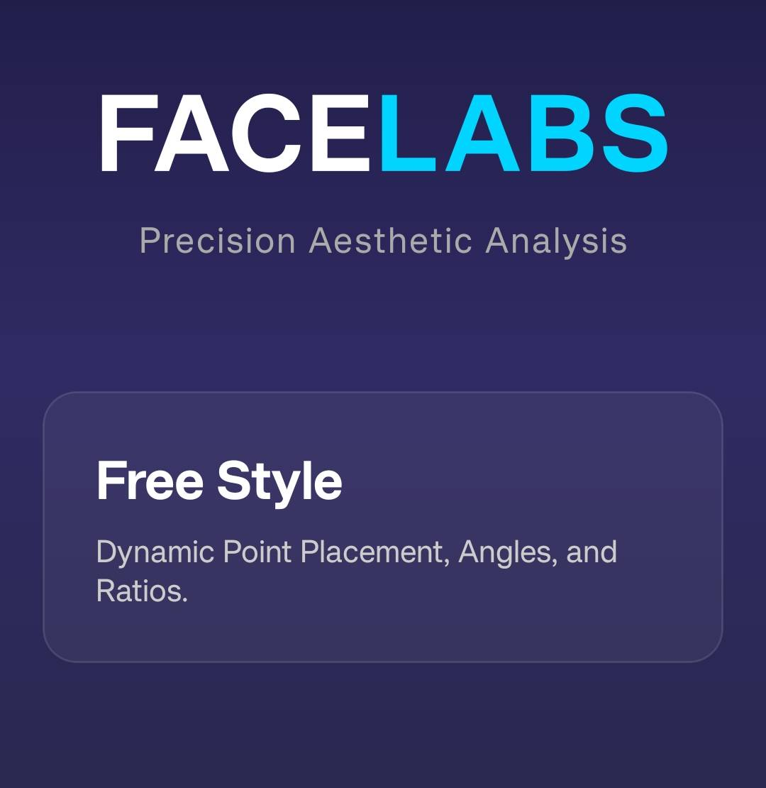
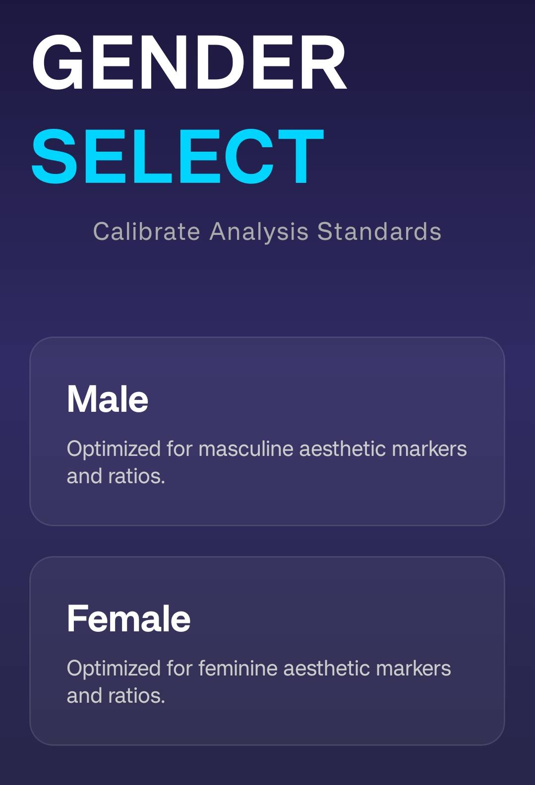
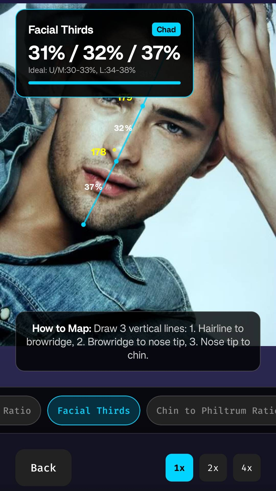
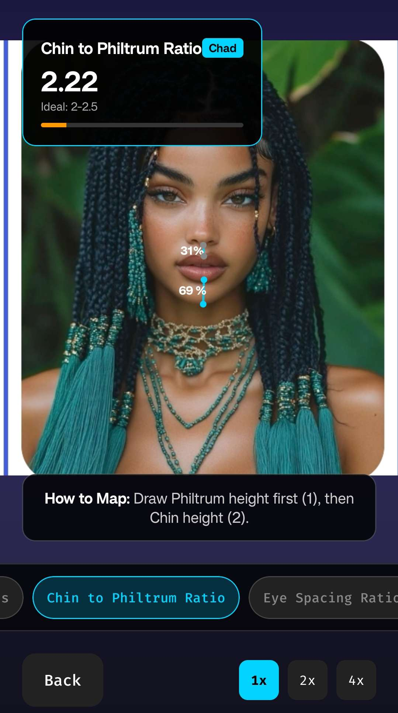
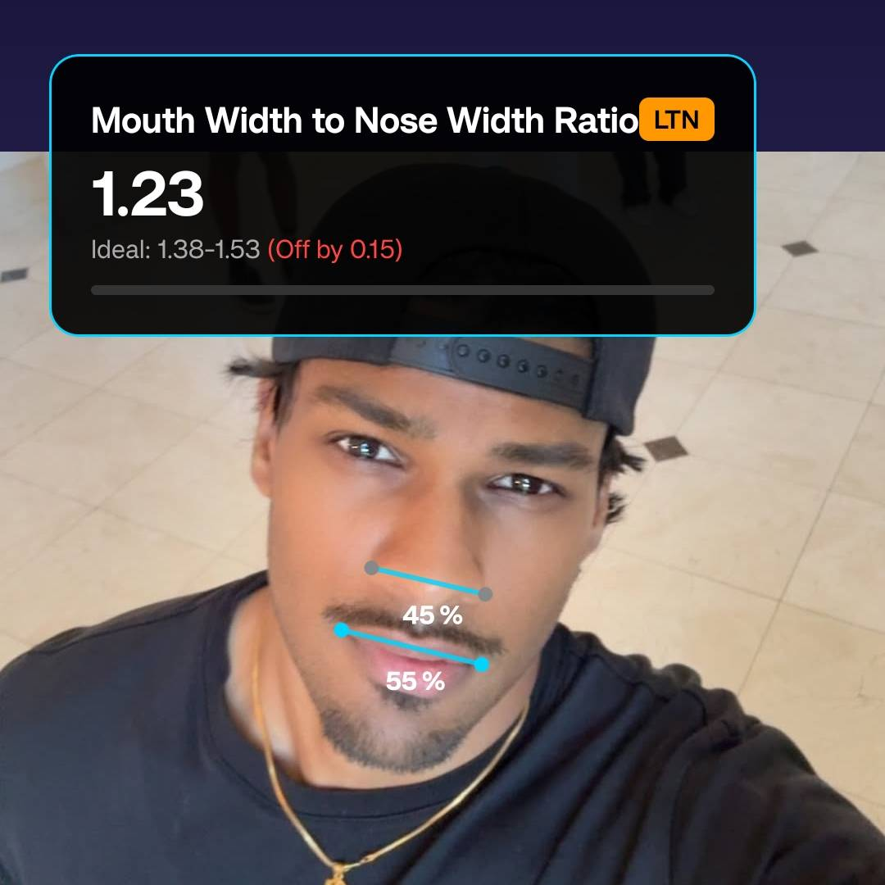

# FaceLabs

  
  
<i>State-of-the-art facial analysis and aesthetic evaluation.</i>

---

## Overview

**FaceLabs** is a premium mobile application designed for professional-grade facial analysis. Built with React Native and Expo, it leverages geometric algorithms to analyze facial landmarks and provide detailed scores across multiple aesthetic pillars.

Originally conceived as a high-fidelity "lookmaxxing" tool, FaceLabs provides users with scientific insights into their facial harmony, dimorphism, and structural angularity.

## Features
- **100% Offline** – All analysis is performed locally; your data never leaves your device.
- **Completely Free** – No subscriptions, hidden costs, or paywalls.
- **No AI Assumptions** – Pure geometric calculations based on professional anatomical frameworks.
- **Zero Ads** – A clean, premium experience without interruptions.

### Dual-Mode Analysis
- **Guided Mapping**: A step-by-step walkthrough to accurately place landmarks using high-resolution preview guides.
- **Free Style Mapper**: Complete flexibility to measure any custom angle, ratio, or percentage with real-time feedback.

### Advanced Scoring System
Our proprietary scoring algorithm evaluates your face across four distinct pillars:
*   **Harmony**: Balance of facial thirds and ratios.
*   **Dimorphism**: Sexual dimorphism indicators (fWHR, Canthal Tilt, Brow prominence).
*   **Angularity**: Jaw definition (Gonial Angle, JFA) and structural support.
*   **Soft Tissue**: Nasolabial and Mentolabial transitions.

## Previews

  
  
  
  

## Installation

FaceLabs is currently available for Android. To get started:
1. Navigate to the **[Releases](https://github.com/acedmicabhishek/FaceLabs/releases)** section.
2. Download the latest `.apk` file.
3. Install the APK on your Android device (ensure "Install from Unknown Sources" is enabled).

---

  <i>"Science-based aesthetics, delivered through premium design."</i>

